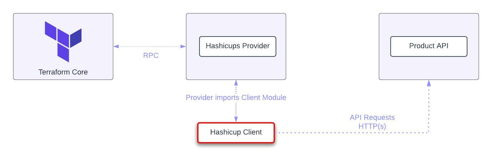

# Hashicups Client (Go)

A Go client package that provides a transient connection between [terraform-provider-hashicups](https://github.com/hashicorp/terraform-provider-hashicups) and [product-api](https://github.com/hashicorp-demoapp/product-api-go). You do not need to compile this package; the HashiCups provider uses it as a dependency. 

Using this module, the Hashicups provider establishes a new client and sends HTTP(s) requests to the product api application to perform CRUD operations. It also handles data mapping from user's inputs to `models.go`. The Hashicups URL defaults to `http://localhost:19090` and you can configure it [here](https://github.com/hashicorp-demoapp/hashicups-client-go/blob/main/client.go#L11) in case that port is already in use. This module also handles API calls to sign up, sign in and sign out for users authentication.